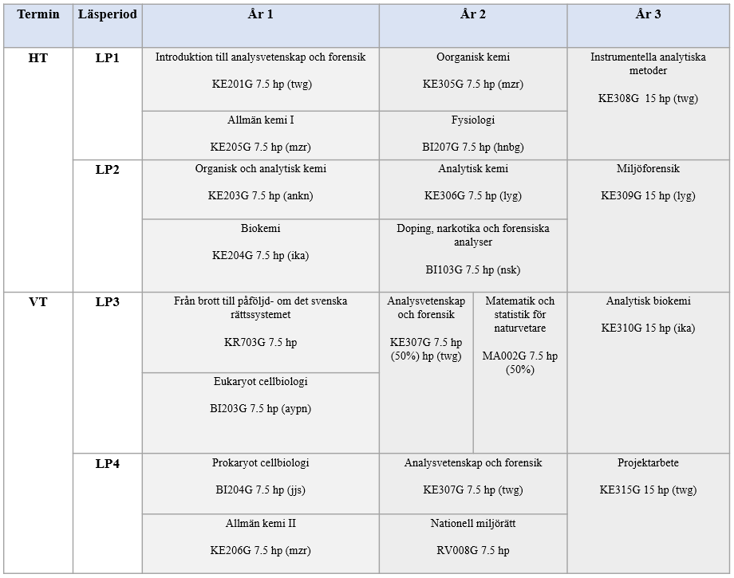

# Upplägg
Här ser ni det rekommenderade upplägg för olika kurser under de tre åren i programmet. 

Initialer inom paranteser visar kursansvarig lärare för varje kurs. Dessa är:  
[Thanh Wang (twg)](https://www.oru.se/personal/thanh_wang)  
[Michaela Zeiner (mzr)](https://www.oru.se/personal/michaela_zeiner)  
[Anna Kärrman (ankn)](https://www.oru.se/personal/anna_karrman)  
[Irina Kalbina (ika)](https://www.oru.se/personal/irina_kalbina)  
[Ajay Pradhan (aypn)](https://www.oru.se/personal/ajay_pradhan)  
[Janna Jass (jjs)](https://www.oru.se/personal/jana_jass)  
[Håkan Berg (hnbg)](https://www.oru.se/personal/hakan_berg)  
[Leo Yeung (lyg)](https://www.oru.se/personal/leo_yeung)  
[Nikolai Scherbak (nsk)](https://www.oru.se/personal/nikolai_scherbak)  

   

