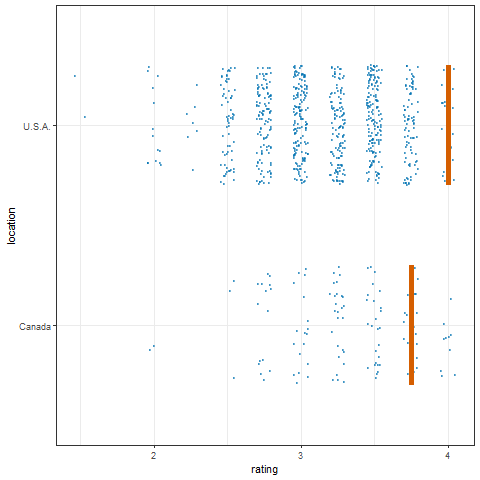

```{r startup, echo=FALSE, warning=FALSE, message=FALSE}
library(dplyr)
library(shiny)
library(widgetframe)
library(plotly)
library(kableExtra)

# Check Harvey for data analysis
# https://dtharvey.github.io/data_analysis/Pages/TOC.html

```


Här använder vi det berömda [Iris](https://en.wikipedia.org/wiki/Iris_flower_data_set) dataset som introducerades av den berömda statistikern Ronald Fisher för att klassificera tre olika blommor ur familjen irisblommor ( _Iris setosa_, _Iris virginica_ och _Iris versicolor_) utifrån längden (eng. Length) och bredden (Width) av deras kronblad (Petal) och foderblad (Sepal).
  
  

Som vi ser så ser dessa irisblommor väldigt lika ut. Nedan tabell visar resultat av dessa mätningarna (enhet = millimeter, mm).
  
```{r DT, echo=FALSE, warning=FALSE, message=FALSE}

iris %>%
  mutate(SampleID = seq_along(iris$Sepal.Length)) %>%
  select(SampleID, everything()) %>%
  kable() %>%
  kable_styling(latex_options = "striped") %>%
  scroll_box(height = "600px", width = "70%")


```

<br>


Vi kan se intressanta mönster om vi lägger ut dessa data i diverse diagram.
```{r plotly, echo=FALSE, warning=FALSE, message=FALSE}


plot_ly(data = iris, x = ~Sepal.Length, y = ~Petal.Length, color = ~Species) %>%
  plotly::add_markers()

```


<br>

# Användning av animationer för att beskriva statistik
Paste Ungeviz gif



